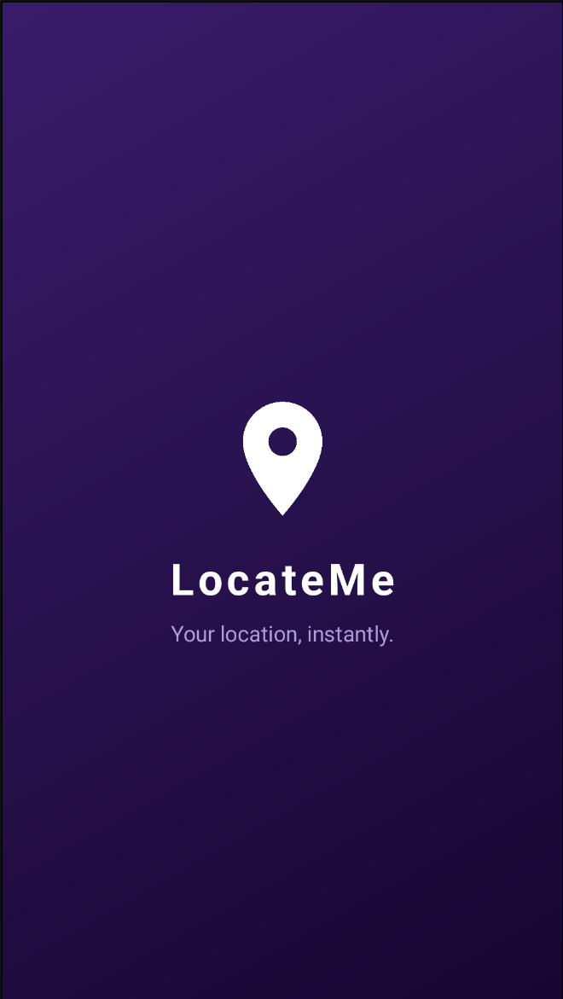
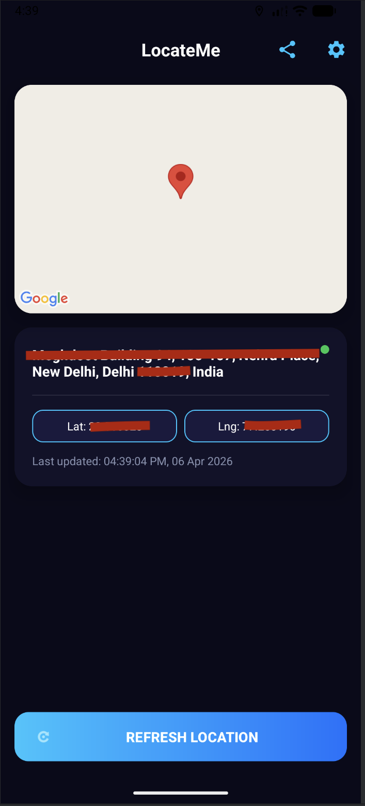
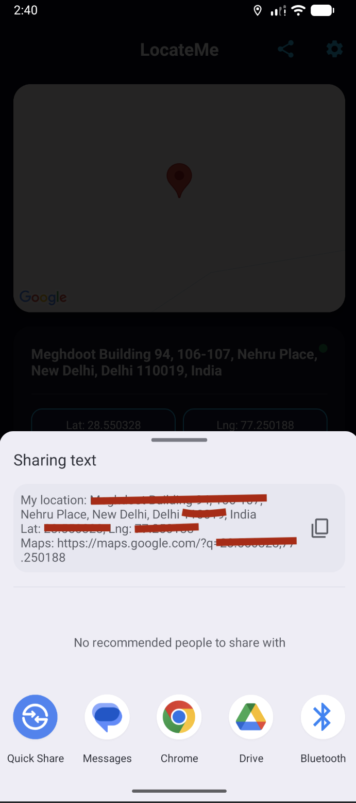

<div align="center">



# 📍 LocateMe
### Your location, instantly.

[](https://android.com)
[](https://kotlinlang.org)
[](https://developers.google.com/maps)

</div>

---

## 📱 Screenshots

<div align="center">

| Splash Screen | Current Location | Share Location |
|:---:|:---:|:---:|
|  |  |  |

</div>

---

## ✨ Features

- 🗺️ Live Google Maps with real-time location marker
- 📌 Reverse Geocoding — shows your full address
- 🛰️ High Accuracy GPS using FusedLocationProviderClient
- 📤 One-tap location sharing with Google Maps link
- 📋 Long press to copy Lat/Lng to clipboard
- 🌙 Premium dark UI with animated splash screen

---

## 🚀 Setup

1. Clone the repo and open in Android Studio
2. Add your Google Maps API key in `AndroidManifest.xml`
3. Run on device or emulator
```xml
<meta-data
    android:name="com.google.android.geo.API_KEY"
    android:value="YOUR_API_KEY_HERE" />
```

---

## 📄 License
MIT License — free to use and modify.

<div align="center">
Made with ❤️ using Kotlin · ⭐ Star if you like it!
</div>
